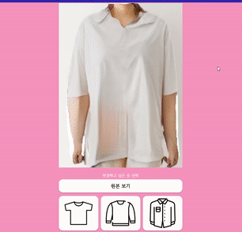
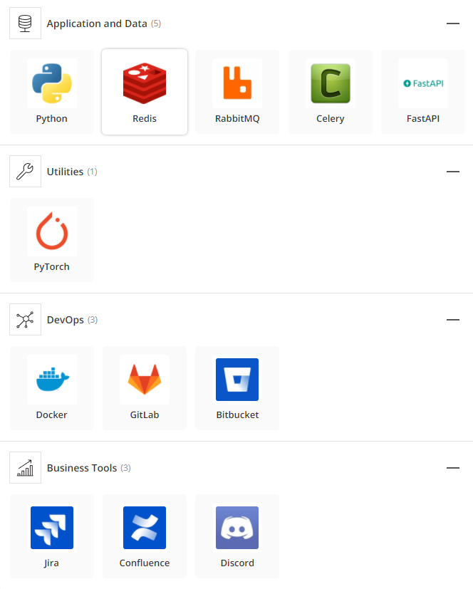

# 쥬쥬의 옷장 프로젝트

## [Demo Page - 바로가기](https://frida.rora.es/)
**현재 AWS 지원기간이 끝나서 하드웨어 스펙이 부족한 상황이라 연산에 약 60초정도의 시간이 소요됩니다.**
## 1. 진행기간
* 1차 진행기간 : 2021.8.15 ~ 2021.09.17 (5주)
* 2차 진행기간 : 2021.09.18 ~ 2021.10.17 (5주 팀원들의 취업활동으로 인하여 잠정적으로 중단)
## 2. 주요내용
* 1차 진행기간 : starGAN을 통한 옷의 카테고리 변경 app 개발하였습니다.
* 2차 진행기간 : 내부 모듈을 docker image화 및 gitlab을 통한 CI/CD 진행하였습니다.
## 3. 프로젝트에 사용된 모델 및 기술 스택 
* 모델
  1. StarGAN v2 : multi domain Image transfer
     * https://github.com/clovaai/stargan-v2
  2. U2net : human segment model
     * https://github.com/xuebinqin/U-2-Net
  3. MHP(Multi Human Parsing) : human parsing model
     * https://github.com/ZhaoJ9014/Multi-Human-Parsing  
* 내부 구조

* 사용된 스택  

* Bitbucket에서 CI/CD를 시행할 때 어려움이 많아 gitlab으로 이전하였습니다.
* 협업, 이슈 관리툴로 Jira를 사용하였고, 문서 작성이 필요할시에는 Confluence를 같이 사용하였습니다.
* 그외의 화상, 음성미팅은 Discord와 Slack을 사용하였습니다.
## 4. 이 프로젝트에 기여한 부분
* 계획 단계(주제 선정, 주요 모델 선정)
* 학습 데이터 가공 방식 선정 및 학습 데이터 가공 
* StarGAN 모델 학습
* U2net의 모듈화 및 docker image building
* gitlab pipeline을 통한 U2net CI
## 5. 프로젝트를 진행하면서 어려웠던점
* 데이터 관련 문제
  * 문제 : 기존 stargan_V2에서 학습시켰던 데이터는 얼굴이라는 어느정도 위치가 지정되어 있는 데이터셋 이었지만 fashion 카테고리에 존재하는 데이터들은 포즈, 옷의 패턴, 색등 이 같은 카테고리의 옷일지라도 정말 다양한 특징들을 보여주었기 때문에 데이터를 정제할 필요가 있었습니다.
  * 해결방안 : 이 부분은 따로 detecting 하는 모델을 학습시키려고 시도하다가 시간과 학습할 vram 부족 등의 이유로 팀원 모두 손으로 3일동안 bbox 라벨링통해 각 도메인별 6000~7000장을 구했고, 라벨링 한 데이터를 U2net을 통한 학습 노이즈가 될 배경 제거 및, bbox 라벨링 한 부분을 crop해서 상의 부분만 학습시켰습니다.
* output 문제(미해결)
  * 문제 : 처음 프로젝트에서 기대했던것은 색, 패턴은 일정한 상태에서 옷의 모양만 변하는 것이었는데 mapping network 에서 뽑아낸 style code와 같이 변경시켰을때 옷의 색까지 변해버려 완전히 다른옷이 되어버리는 문제가 존재했습니다.
  * 생각중인 해결방안 : Controllable Generation 을 이용한 noise 컨트롤로 색관련 Feature를 특정하는 방식(Unentangle) 이나 classifier Gradients 이용하여 noise간 거리를 측정해서 학습(entangle Feature)통해 해결할 수 있다고 생각되어집니다.
## 6. 결과 및 성과
* output으로 나온 이미지의 외형변화를 확인 할 수 있었습니다.
* StarGAN, StarGAN_V2을 비롯한 GAN 관련 논문 및 강의를 보았고, GAN에 대한 기본지식을 배우고 성장할 수있는 기회가 되었습니다.
* Docker image를 만들고 컨테이너를 돌려볼 수 있는 경험을 얻었습니다.
* gitlab-ci를 가이드라인에 따라 작성해보고 pipeline을 실행 해 본 경험을 얻었습니다.
## 7. 아쉬웠던점
* 처음시도해 보았던 GAN이었기 때문에 기초지식이 부족한 상태로 시작해서 시간 + 물리적 제약을 고려하지 못한 상태로 계획를 세워 시간관리가 매우 힘들었습니다. 이러한 점 때문에 팀원들과 Coursera GAN 강의를 듣는 스터디를 진행하였습니다. 
* 팀원들이 발표가 끝난뒤 기능은 완성했지만 직접 배포하기에는 아직 부족하다는점을 근거로 팀원들과 함께 프로젝트의 docker 컨테이너화 및 코드유지보수, CI/CD구현을 목표로 2차적인 프로젝트를 시작하였습니다.